# Advanced Lane Detection


In this project, we apply computer vision techniques to detect road lane, raod radius curvature and road centre offset. 

The following animiation shows a shot of final result of lane detection.


### Final result with debugging output is from [YouTube Video](https://youtu.be/-1EuZM6DsiA).


### The goals / steps of this project are the following:


* Compute the camera calibration matrix and distortion coefficients given a set of chessboard images.
* Apply a distortion correction to raw images.
* Use color transforms, gradients, etc., to create a thresholded binary image.
* Apply a perspective transform to rectify binary image ("birds-eye view").
* Detect lane pixels and fit to find the lane boundary.
* Determine the curvature of the lane and vehicle position with respect to center.
* Warp the detected lane boundaries back onto the original image.
* Output visual display of the lane boundaries and numerical estimation of lane curvature and vehicle position.

[//]: # (Image References)

[image1]: ./examples/undistort_output.png "Undistorted"
[image2]: ./test_images/test1.jpg "Road Transformed"
[image3]: ./examples/binary_combo_example.jpg "Binary Example"
[image4]: ./examples/warped_straight_lines.jpg "Warp Example"
[image5]: ./examples/color_fit_lines.jpg "Fit Visual"
[image6]: ./examples/example_output.jpg "Output"
[video1]: ./project_video.mp4 "Video"


### Camera Calibration

I started by preparing "object points", which will be the (x, y, z) coordinates of the chessboard corners in the world. Here I was assuming the chessboard is fixed on the (x, y) plane at z=0, such that the object points are the same for each calibration image.  Thus, `objp` is just a replicated array of coordinates, and `objpoints` will be appended with a copy of it every time I successfully detect all chessboard corners in a test image.  `imgpoints` will be appended with the (x, y) pixel position of each of the corners in the image plane with each successful chessboard detection.  

I then used the output `objpoints` and `imgpoints` to compute the camera calibration and distortion coefficients using the `cv2.calibrateCamera()` function.  I applied this distortion correction to the test image using the `cv2.undistort()` function and obtained this result: 


### Pipeline (single images)

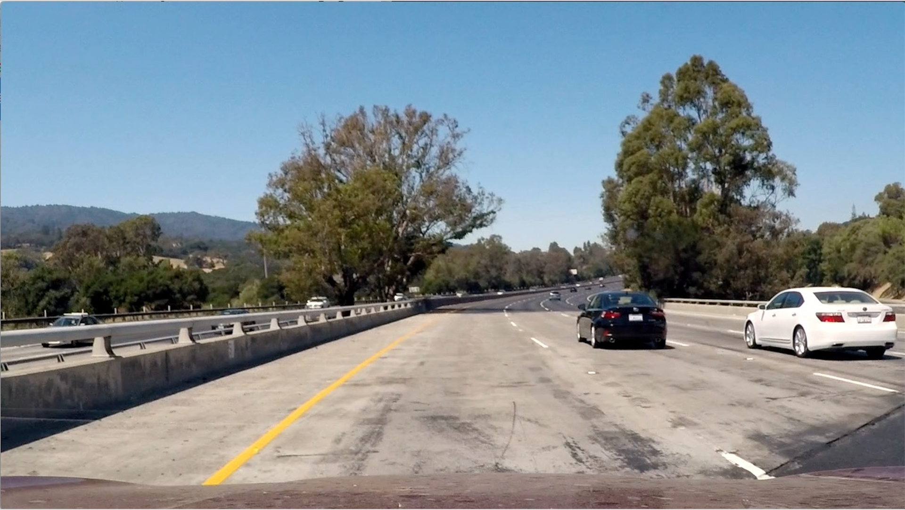

**This is an example of a distortion-corrected image after applying the distortion correction to one of the test images. **

---

### Applying distortion correction to a sample road image
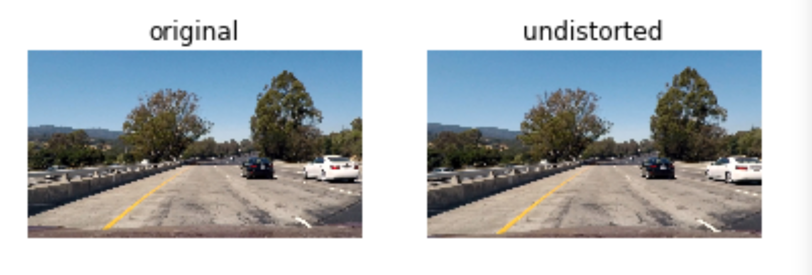

---

I used a combination of color and gradient thresholds to generate a binary image.  Here's an example of my output for this step. 


**This example of binary image result is created by using a combination of color and gradient thresholds and other methods.**

## Perspective transform --- Bird-eye View Transform


To be able to detect the road lines, the undistorted image needs to be warped. The `warped_image()` function takes an image's height and width and then calculates the source(`src`) and destination (`dst`) points. `perspective tranform` takes them and return two matrixes `M` and `Minv` for `perspective_warp` and `perspective_unwarp` functions respectively. 

The following image, shows an undistorted image, with the src points drawn with the corresponding warped image (the goal here was straight lines)

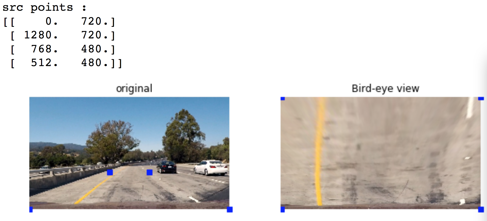


## Color Mask


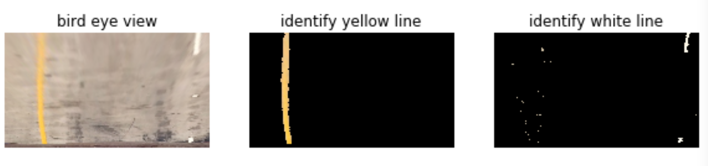

I used color mask to detect yellow and white pixels in an image seperately. Color mask is applied after applying `cv2.cvtColor( )` function to transform RGB to HSV space, as HSV is more suited for color detection.

# Sobel Filters

In addition to the color masks, I applied sobel filters to detect edges. I applied sobel filters on S channel of image after converting it to HLS, and on B channel of the original RGB image, as these were found to be robust to color and lighting variations. I then applied the magnitude and direction of the gradient to keep only pixels with values above a threshold (different threshold for magnitude and direction) on both images. After multiple trial and error, I got good candidates to identify the edges.

Finally, I combined color mask and sobel filters together through bitwise_or to get the final mask, the following picture showed this step:


|      combined_mask example1   | combined_mask example2 |
|:------------------------------|:-----------------------|
|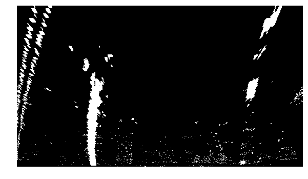|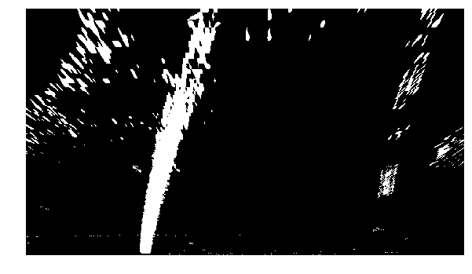


```python

```

## Detect lane pixels and fit to find the lane boundary

Once we have the lane mask, we then compute lanes at the bottom half of the image by computing the location of peaks corresponding to the left& right lane. Next, we are going to detect lane lines and then fit a polynomial to draw lines. To identify lane line more accurately, I placed left&right window box centered at the peaks at the bottom of 1/8th image to start searching pixels, and after more than 50 pixels were detected in either left&right line, I then fit a polynomial to draw the curve line on each side.

Here are some image results showed the step.


|   left lane histogram   |    lane slice    |    right lane histogram
|:-------------------|:-----------------|:-------------------
|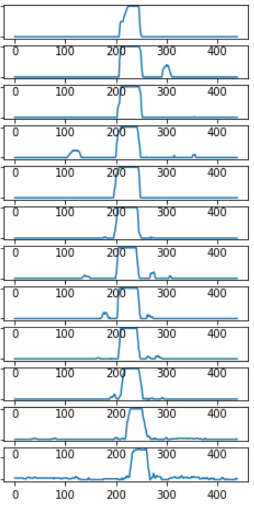|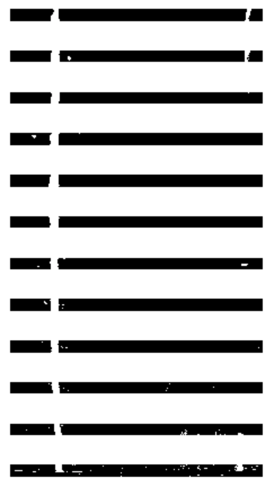|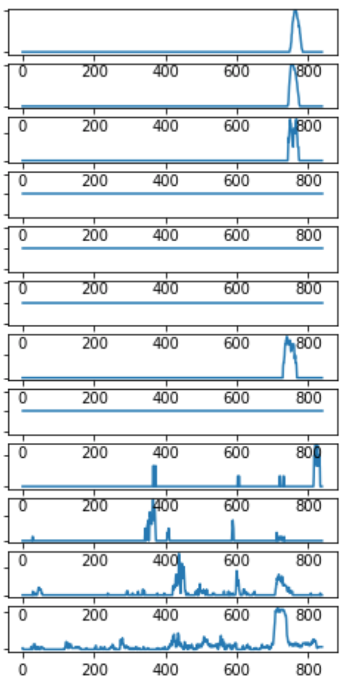

---

* window search

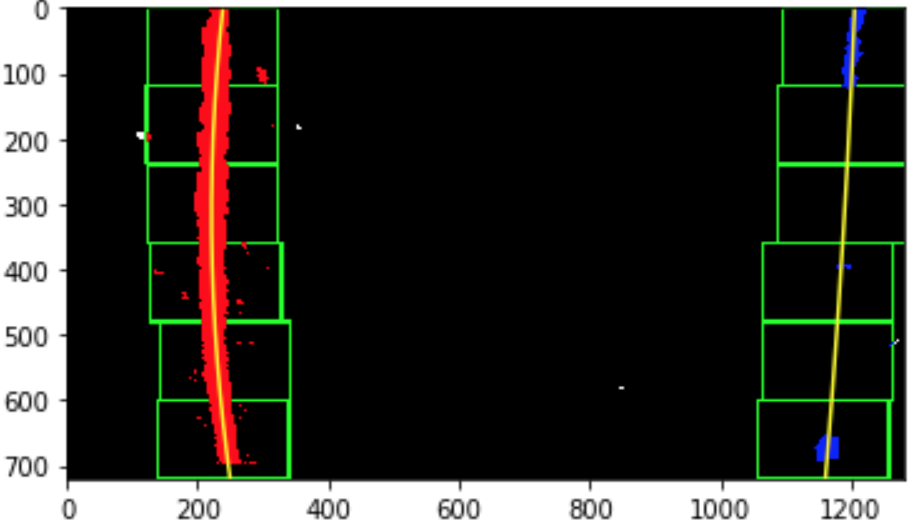

---

* fit polynomial

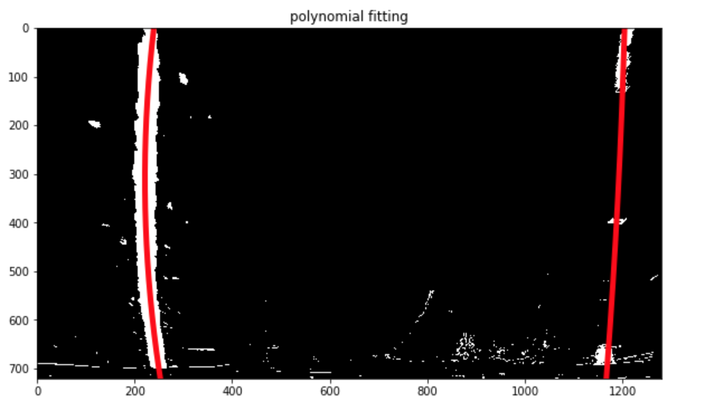

---

After computing the lanes, we draw them back on the origianl undistorted image as follows:

* color warp on original image


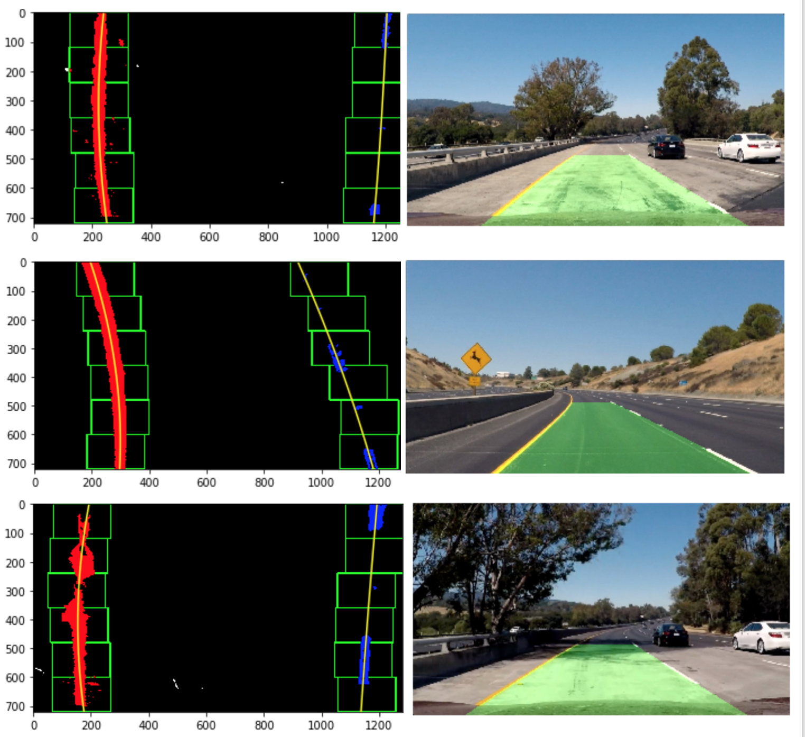 


Finally, we ended up computing curvatures of the lane and relative location of car in the lane
 
## Final result examples


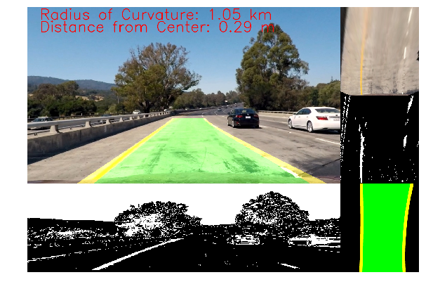

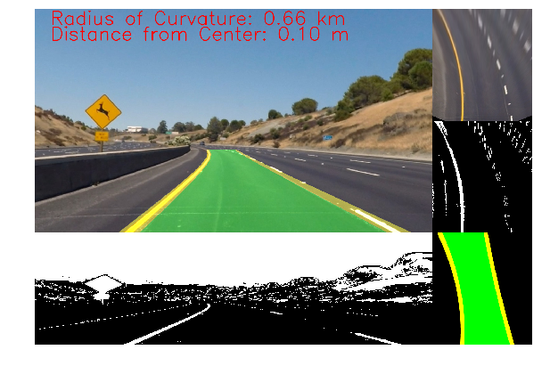

# Reflection 

This project took me a lot of time on tuning several parameters, however, I really learned a lot from computer vision as this whole project was done by using various methods provided by cv2. In this project, I found computer vision solutions are sensitive to the chosen parameters, if the parameters are not chosen correctly, they will fail. 


```python

```
